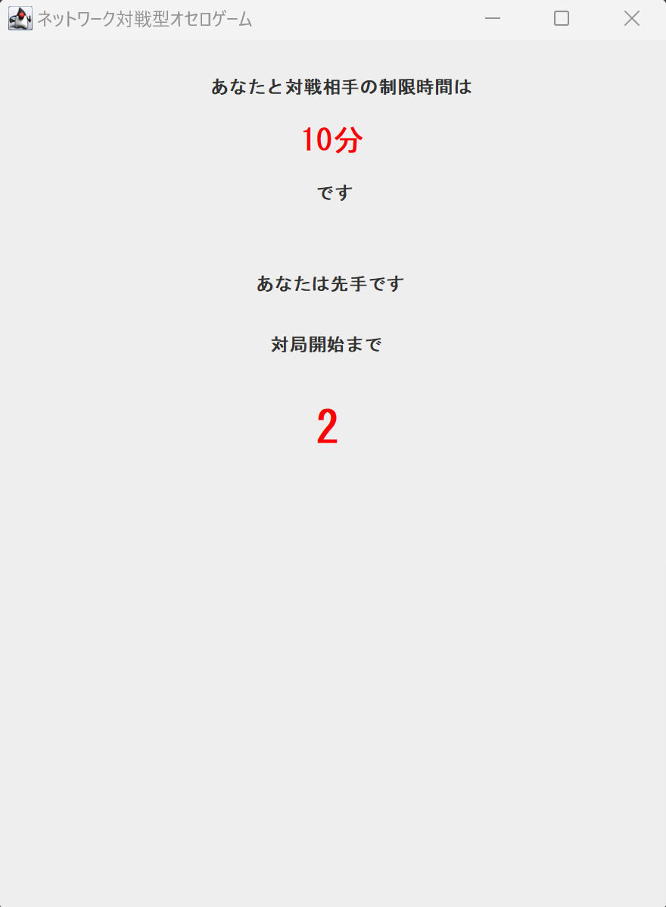
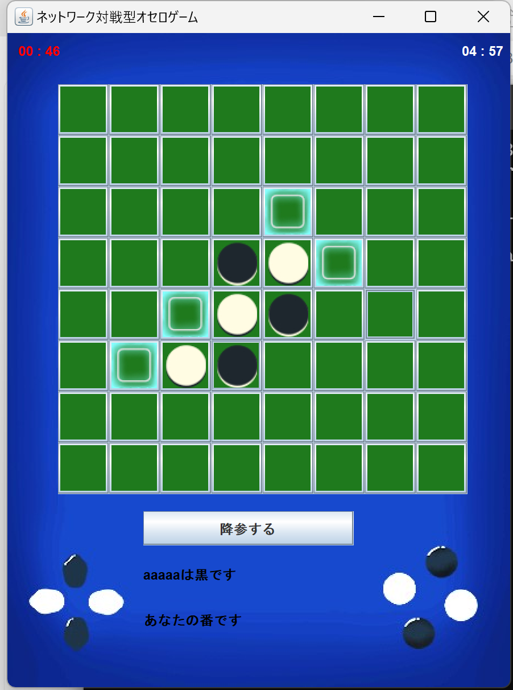

# Project_Learning1
- プロジェクトラーニング講義にて、5人チームで作成したオセロゲーム。

## 仕様
- クライアント側プログラムをゲーム参加者が動かす。
- 対戦相手がやってくるとマッチングして、時間選択の画面に移る。
- 参加者は、それぞれ時間を選択する。選択が同じ場合は、その制限時間でゲームがスタートする。異なった場合は、相手に時間を合わせるか選択する画面に移る。その結果、両者の合意が得られたら、その時間で決定するが、合意が得られない場合はランダムで、どちらかの参加者が選択した時間となる。
- 対局開始までのカウントダウンがある。
- 制限時間が画面上部に表示される。
- 次のコマを置ける場所をハイライトする機能がある。

## 画面イメージ

